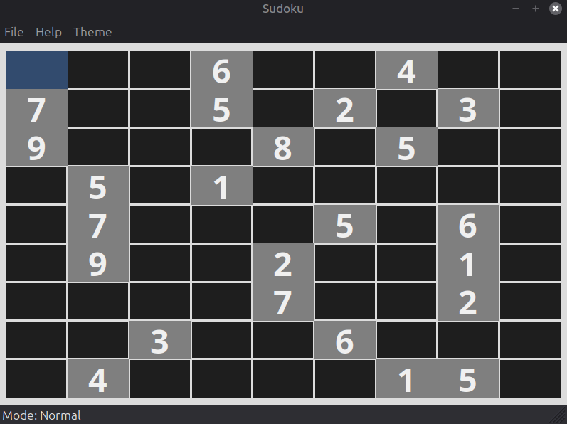

This is an implementation of Sudoku using C++20 and the wxWidgets library.



The app has the following simple features:

- You can save and load your game in a .txt file
- You can play a game based on a sample of puzzles from [3 million Sudoku puzzles with ratings dataset](https://www.kaggle.com/datasets/radcliffe/3-million-sudoku-puzzles-with-ratings?)
- You can also generate a custom game either from using the pre-existing puzzles or from a random start with the desired amount of starting clues
- You can enter notes mode with the letter N in order to keep notes on the board without modifying the puzzle itself
- You can use both mouse and keyboard to navigate the board
- You can also change from dark theme to light theme with adding more being very easy

The code used to filter the puzzle sample is in [here](./src/filter_puzzles.ipynb).
## Dependencies
```
sudo apt-get update
sudo apt-get install -y build-essential cmake git libwxgtk3.2-dev
```
## How to compile locally
~~~
git clone https://github.com/evanlour/Simple_sudoku_app.git
cd Simple_sudoku_app
cmake -S . -B build
cmake --build build -j2
./build/Sudoku
~~~
## License
This project is licensed under the MIT License - see the [LICENSE](LICENSE) file for details.