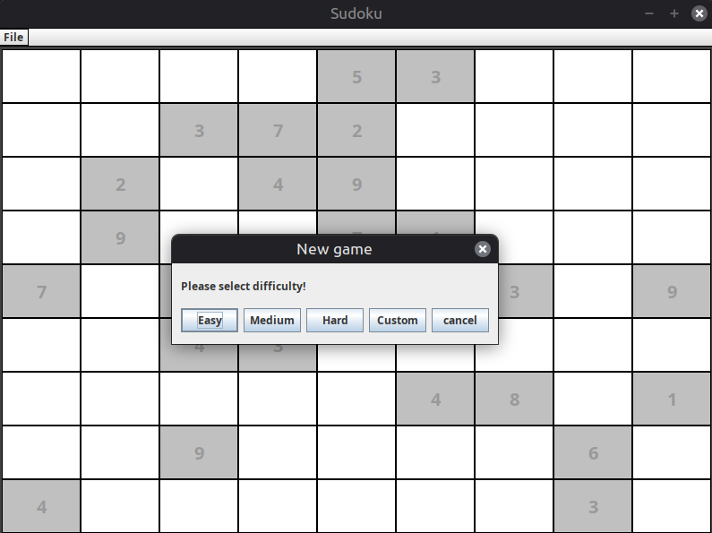

# Sudoku
**Warning! This is a much older version written with java, for the newer version, navigate to the [parent folder](..)**

This is the legacy/old version of my Sudoku app. It's UI is based upon Java Swing and it used Maven to compile.
It implements the naive sudoku backtracking algorithm to create a sudoku puzzle. The user can choose between multiple difficulties as well as a specific number of clues between 17 and 40. Internally, during the generation phase the program randomly distributes a set number of numbers and then checks if a possible solution exists. If it does not it starts from scratch. The process repeats until a valid solution is identified. Then, the player is tasked to solve the sudoku. If it does not fit the player's skill-base or mood due to it being too easy or hard, he can regenerate a new sudoku with a different given set of numbers. The program utilizes 2 threads: One for the graphical interface and one for the algorithm runtime.

## Prequisites
An environment supporting at least Java 8 for environment.
## How to compile locally
A pom.xml file is provided to compile using maven. Inside the legacy subfolder run:
~~~
mvn clean package
java -jar sudoku-1.0-SNAPSHOT.jar
~~~